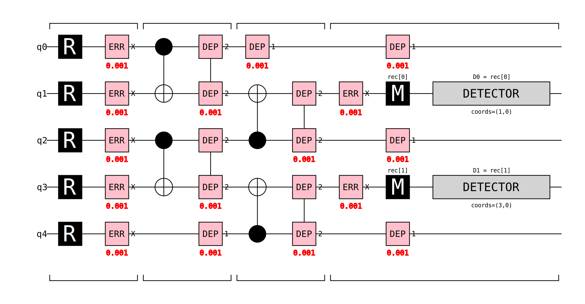
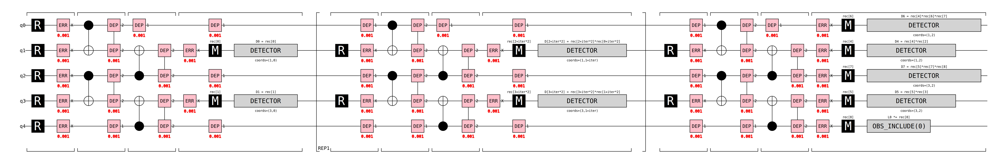

# Quantum Error Correction from Scratch: Building a Repetition Code with STIM

### Why QEC matters
Quantum Computers are known to be notoriously easy to disturb, and inherently noisy. Gate errors, decoherence  and measurement errors can all lead to corrupt computation.  Although errors have decreased dramatically through refined engineering, there is still massive need for error correction via classical computation. This short project follows Googles quantum course on quantum error correction and builds up a simple circuit for repetition code to correct for bit flips (X-errors) using `stim`. This essay is a brief method for consolidating what I have learnt so far. 

### The Repetition Code
The repetition code works by building a logical qubit out of multiple data qubits that should all individually represent the logical cubit, and a majority vote from all the data qubits is used to remove errors. An example of this is a logical $\ket{0}$ encoded as $\ket{000...0}$. If the total data qubits used is d, aslong as there are less then or equal to $(d-1)/2$ errors, the logical qubit will not be corrupted. As the number of data qubits increases, the total number of qubits needed to fail increases linearly and the probability of all of the failing decreases **"exponentially"**  meaning more qubits means more protection, with quantum error correcting codes usually needing at least 1000 qubits to work. The caveat of this specific code is it only protects against bit-flip errors, other errors like phase flip errors are not measured, however it is a good starting point as it is the most intuitive introductory method. 

The method of measuring these qubits can be shown in the diagram below, where the states are linked via the CNOT gates which copy the state across

The circuit above shows a distance-3 repetition code with 5 qubits in total. **q0, q2, and q4** are the three data qubits that together encode the single logical qubit, while **q1 and q3** are ancilla (measurement) qubits used to detect errors without directly reading the data.

The circuit proceeds in four broad stages, separated by the bracket groupings along the bottom:

1. **Reset (R):** All five qubits are initialised to $|0\rangle$. The `ERR X 0.001` gates that immediately follow inject a 0.1% chance of a bit-flip on each qubit, simulating the physical noise present before any operation takes place.

2. **First CNOT layer:** q0 acts as the control for a CNOT targeting q1, and q2 acts as the control for a CNOT targeting q3. A CNOT flips the target qubit if and only if the control is $|1\rangle$, so after this step q1 holds information about q0 and q3 holds information about q2. The `DEP 2` gates model the two-qubit depolarising noise that real hardware introduces during each CNOT.

3. **Second CNOT layer:** q2 now acts as a second control into q1, and q4 acts as a second control into q3. After both CNOT layers, q1 has effectively measured the **parity of q0 and q2**, if the two data qubits agree it reads 0, if they disagree (i.e. one has flipped) it reads 1. Likewise, q3 measures the parity of q2 and q4. Single-qubit depolarising noise (`DEP 1`) is applied to the idle data qubits during this time, capturing the fact that doing nothing on real hardware still introduces errors.

4. **Measurement and detection:** A final `ERR X 0.001` layer before measurement models pre-measurement noise, then q1 and q3 are each measured (M). The **DETECTOR** blocks compare these results — `D0 = rec[0]` at coordinate (1,0) and `D1 = rec[1]` at coordinate (3,0) — to flag any parity change. If D0 fires it means q0 and q2 disagree; if D1 fires it means q2 and q4 disagree. Together the two detectors pinpoint which data qubit most likely flipped, allowing classical post-processing to apply the correct fix without ever collapsing the logical qubit directly.

## Building the Circuit Programmatically

After building a repetition code for distance 3 by hand, I automated it using the function create_rep_code_stim_string(distance, rounds, p). There are three structural phases to the circuit. There first, resets all of the cubits, then has the first round of measurements, then has detectors that compare to the the exepected initial values of the qubits. The second block, which represents every round apart from the first and last, reset the ancillas only, and repeat CNOT sweeps then measures. Detectors are the created between the previous measurement on and current measuments for each respective ancilla circuit. In the final block, data qubits are measured and compared to a final set of ancilla measurments to create the final detectors. 

Detectors "comparing measurments" represents them comparing the parity of the measurments, if they are both even or both odd, no error is flagged, if they are of different paritys, then an error is flagged.

## Comparing to Stims Built in circuit
Stim obvisouly has a built in version method of this function using `stim.Circuit.generated("repetition_code:memory", rounds=..., distance=..., before_round_data_depolarization=p)` However  as shown in the figure below applies noise at less points and is therefore is a less accurate model. The custom model   

## Decoding with PyMatching 
Using the decoders these can be inputted into the pymatchin librarys' method `Pymatching.Matching.decode_batch`. This method uses Minimum weight perfect matching (MWPM) to decode the system. This can described by: building a graph where the detectors are nodes and the possible error mechanisms are edges, weighted by their probability of causing the error. **related to length of circuit by -log(l)?** parings are found for the detectors such that the total edge weight is minimised. This represents the "simplest" explanation for what went wrong. Pymatching was used as it can handle much more complex problems, is highly optimised and is written in C **or maybe c++** which speeds up its search time. 
### Why is MWPM used instead of a majority vote?
MWPM is not more accurate that the majority vote method, for an ideal scenario, however it cannot be used for scenarios where different errors have different weights on the graph. It also cannot be transferred to larger systems such as surface codes.

## Plotting error code rates

The circuit is then ran 10,000 times and the MWPM was compared to the actual output of no errors ($\ket{00... 0}$ woulndt change) for three different distances, at different error rates, and was plotted.

To get more data the library `sinter` was used to use multiple cpu cores and speed up the processes, this is more of a requirement with even larger classical simulations of quantum circuits, as shown in figure...

## Projecting into the future.
Logical error rates per round decreases exponentially, which is linear on a log scale against d. Therefore for a fixed error probability, sinter was ran for d = 3,5,7,9. Which could then be fit to a straight line and projected, to give a prediction of at a code distance of 20, there will only be one error in a trillion rounds. This is just a large simplification of repetition codes that only take bit flips into account .

## Takeaways from the quick project
This is a simple model,  however allowed me to get an understanding of the basics of quantum error correction. the value is pedagogical, ever concept transfering to real ones, and gives me the confidence to look deeper into surface does.