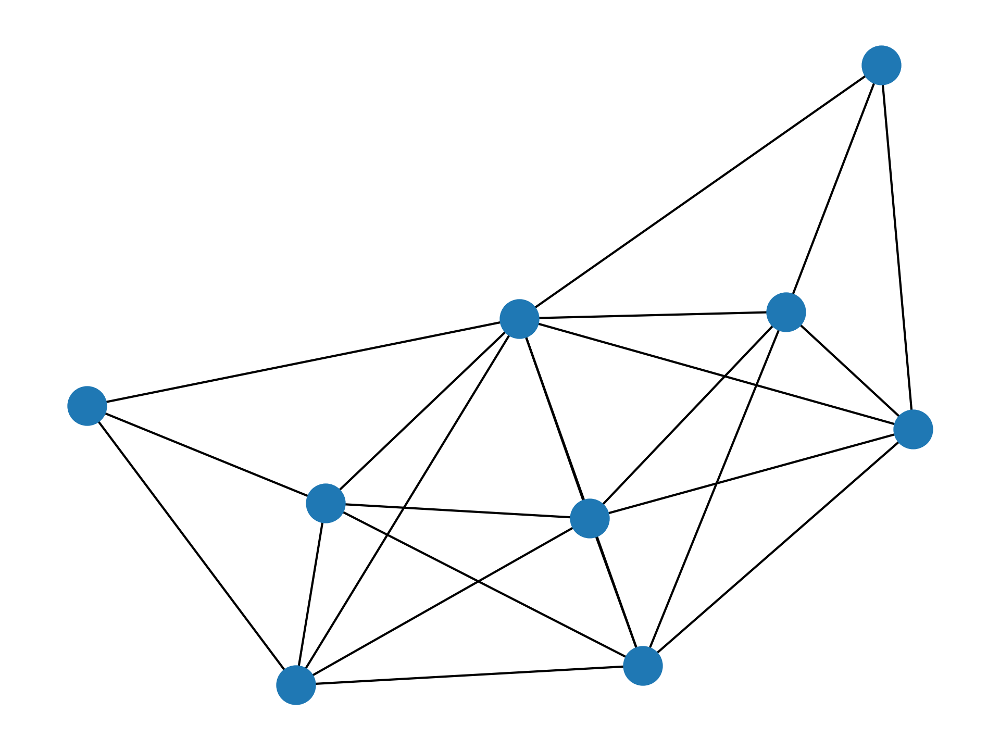
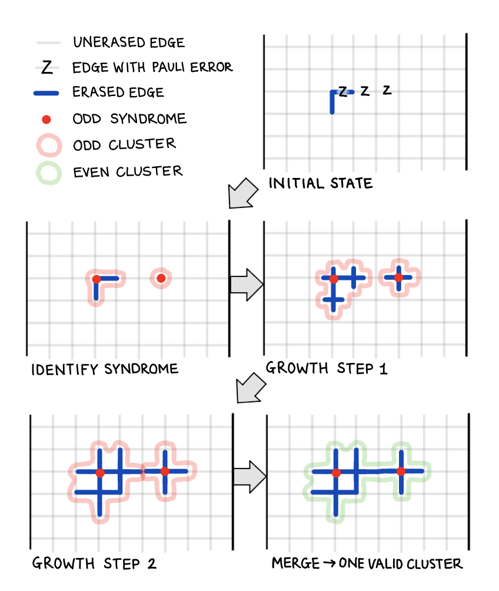
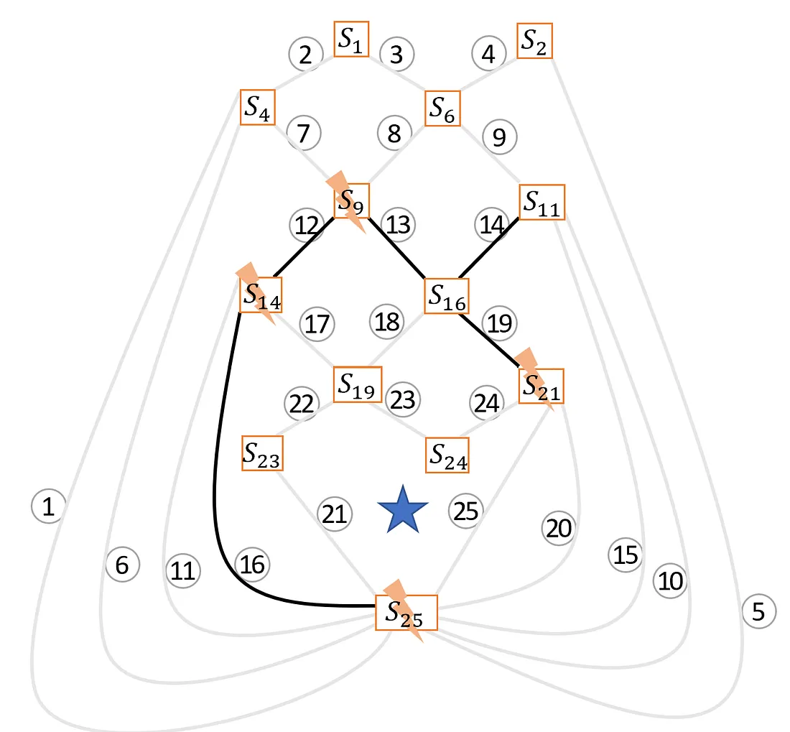
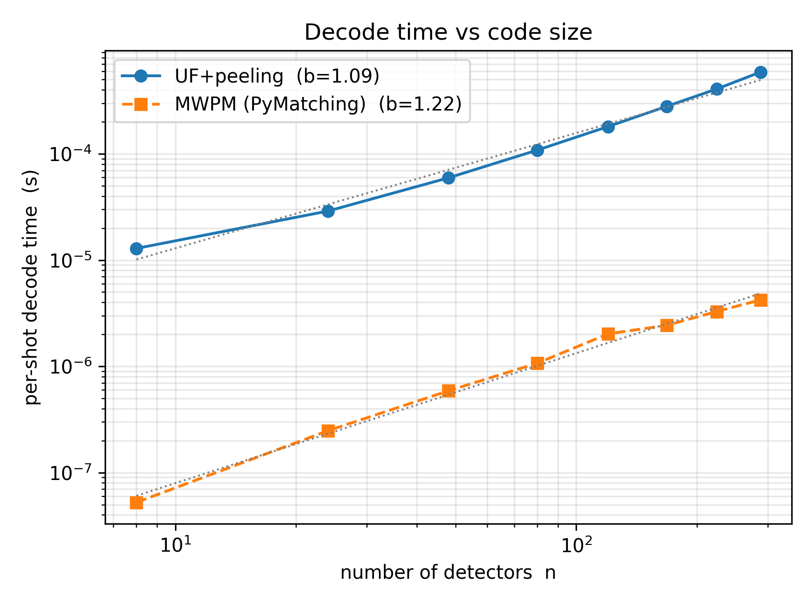
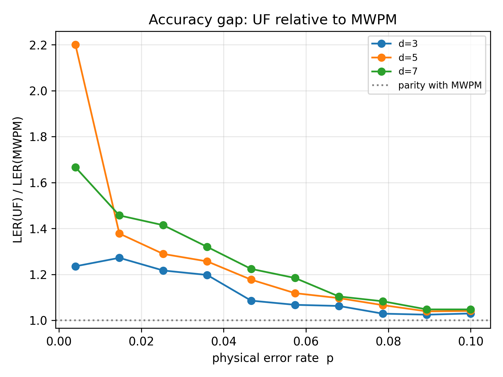
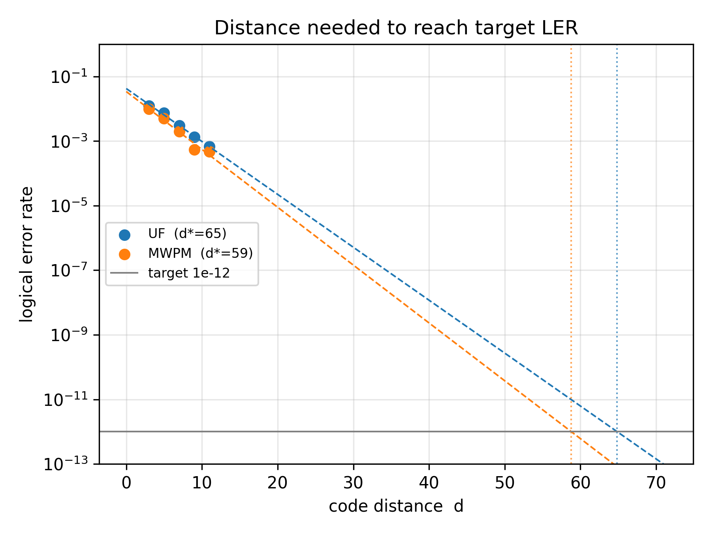
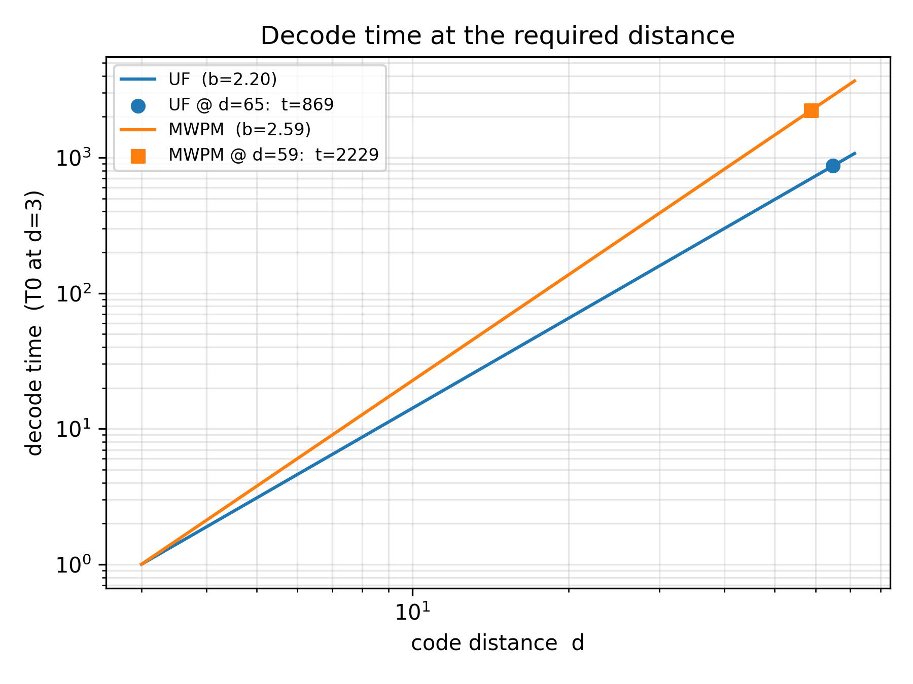

## Go through why decoders are important
As quantum computers get closer and closer to being able to run error correcting code, the need for a fast scalable classical computer decoder, is becoming more apparent. The decoder of choice if Minimum Weight Perfect Matching (MWPM) which is the most accurate decoder however scales with  $O(n^3)$. This report implements the Union Find Decoder, a slightly less accurate decoder however when optimised, scales with $O(\alpha(n)n)$ where $\alpha <= 3$ @Delfosse2021UF. Which gives a faster scalable alternative to MWPM. This report will introduces the concepts behind the Union Find decoder and briefly compares a custom Union Find decoder against Pymatching's (MWPM) @pymatching.

The Union Find algorithm is not a complete decoder, Its aim is to quickly produce as erasure graph, where it simplifies the options of of where qubit errors have happened. This erasure graph then needs to be decoded, using a linear time Peeling Decoder, which will also be explained below @Delfosse_Peel.

## Introduce basic workflow of UF

To produce error corrections using the Union Find decoder, there are 3 main steps in the workflow. First is building a graph that can be understood by the Union Find Algorithm. The graphs Nodes represent staibaliesrs in the surface code and the edges, are data qubits where errors can occur. Staibaliesrs flag a fault in the system by measuring four surrounding data qubits and if the result of the measurement is different to expected, that staibaliesrs will flag a fault, by investigating the which staibaliesrs are flagged, an estimate for the error can be made. A more detailed description of Staibaliesrs and surface codes can be found here @surace_codes. The process of generating this graph from Stims in built `detection_error_model` is difficult and for a shortcut Pymatching's graph was piggybacked and converted to supply the necessary information for the Union Find decoder, this process can be found in `uf_decoder.py` in my QEC repository **Referece**. A figure of Pymatching's graph is shown below:

{#fig-graph}

<!-- ### UF -->

Using the graph above, the Union Find algorithm can be applied. The Union Find algorithms aim is to create clusters of nodes with an even parity, meaning that it creates clusters of Nodes where an even number of Nodes that have raised a concern are even, The process is shown clearly in the figure below. The process of creating these clusters starts with each error node. Then each cluster's (single node) edges are grown by half an edge length. When two nodes meet, they are checked to see if they are in the same cluster, If not they form a union and join the same cluster. If both of the nodes had initially raised an error, the parity is even and the clusters stop growing. This loop is repeated untill all clusters have an even parity. 

::: {#fig-graphs1 layout-ncol=2}

{#fig-uf}

{#fig-peeling}

Visualisations of algorithms: Figure (a) grid layer is used as it is clear how clusters expand through nodes, Figure (b) uses a visualisation of a graph structure more like in @fig-graph, which allows a third dimension to be implemented more easily if we were to also decode for measurement errors. 
:::

<!-- {#fig-uf} -->

<!-- ### Peeling -->
<!--  -->

With all these clusters found, the erasures referenced earlier which are used by the peeling decoder are represented by the thick blue lines in @fig-uf. These erasure edges and their respective Nodes, then have to be traversed into a spanning forest using breadth first search @PotatoCoders2020. This is done such that the boundary node is traversed first when making the spanning forest. This is due to us wanting to peel the boundary node last to stop all errors first option being to claim that the error is between the node and the boundary when there are other more likely options. A simple example of the peeling process is explained next with help with @fig-peeling. Peeling works by starting at a child edge child edge (an edge that is only attached to one other edge). The node that is only connected to that edge is called pedant vertex, first remove that edge. Then, if the pedant vertex's flag represents an error, Add the edge to a list of known qubit errors and flip the error state of the other vertex. If the pedant vertex doesn't claim an error, remove the edge and do nothing else. By working through this method, with each round starting with a child edge, on the figure you will quickly find the estimate for the errors is on edges: [13, 16, 19]. Which is correct!

<!-- {#fig-peeling} -->

## Comparing Union Find to MWPM
With The decoder now complete, it can now be compared to Pymatching's MWPM aglorithm. The two main items to test are the scaling of speed and the logical error probability, both of which have been tested and shown below

### Looking at the speed scaling

As the custom Union Find decoder was created in python it is linearly slower than Pymatching's decoder which is a wrapper to a decoder written in c++ @pymatching. This means that at first look the MWPM looks faster however, over several varing distances, it can be seen that the Union Find decoder represents better scaling which a lower gradient, shown in @fig-t-s. As it is a loglog plot, a gradient (b) of 1 would be linear decoding time. 

::: {#fig-plots1 layout-ncol=2}

{#fig-t-s}

{#fig-ratio}

Fist Comparisons of Union Find and MWPM
:::

<!-- {#fig-t-s} -->

### Compaing logical error predictions between UF and MWPM

As with the repetition code, logical error rate was varied against physical error rate for 3 different distances with both decoders. the ratio of Logical error probability for UF against MWPM is then plotted in @fig-ratio . As expected the line is always positive showing the Union Find is less accurate, however does the increased spread make it worth it?
<!-- {#fig-ratio} -->

To find out if the union find decoder is worth it for required logical error rate for practical quantum computing (1e-12) @surace_codes. Similar to the repetition code analysis, both decoders logical error results could be extrapolated forwards in order to determine the distance required to reach a target logical error. With these target distances and normalising the timings so the C++ MWPM code does not have a systematic error. The timings required for each decoder to decode their required distance could be used to determine which decoder is faster for a required error target. This is shown in @fig-d-ex and @fig-t-ex

::: {#fig-plots2 layout-ncol=2}

{#fig-d-ex}

{#fig-t-ex}

Plots predicting the effectiveness of Union Find and MWPM at real world require logical error levels.

:::

## Results and Future Improvements

Using my custom decoding algorithm based off @Delfosse2021UF @Delfosse_Peel, I found, that the custom UF decoder is slower per shot in absolute terms however scales better than MWPM. This scaling is useful as decoders will be required to decoder over large surface code distances therefor linear or near linear decoders are a must. 

### Ideas for Future Developments 
- In future I should go back and add errors, as error rates come from a finite number of shots they carry a binomial sampling error which could be incorperated into calculations.
- The extrapolations are only over a few small distances, to get more precise results, It should be run over longer distances and shots, which could be done quicker with the incorperation of using multiple CPU codes with sinter.
- The python, C++ comparison using normalisation is crude, and a much more accurate representation would be to rewrite the UF decoder in a compiled language which would be an interesting project to increase my understanding of lower level languages and wrapping them in python using libarys such as c_types.
- The error correction is single round, so measurement errors are not decoded and only one error sector is decoded (X error). This is a simple fix as X and Z errors are independent and the piggybacking of the PYmatchings graph means multiple rounds can easily be incorporated, however they weren't added here for simplicity. 
- Threshold should also be measured to quantitatively display how logical error detection compares over these smaller distances at different error rates, for UF and MWPM
- The union find decoder is also not completely general, it does not account for different weighted edges (for if different errors have different probability), and is not fully optimised as cluster sizes can also be kept track of, and clusters grow in order of size (smaller to largest) as this speeds up the algorithm @Delfosse2021UF.

### What I have learnt:

It gave me a stronger understanding around the workflow required to actually implement a decoding algorithm and also helped me understand that speed and accuracy trade off that will need to be considered in every type of quantum computational system. While a surface code model was technically used I have not yet explored decoding both X and Z errors simultaneously and after reading through "Surface codes: Towards practical large-scale quantum computation" @surface_codes, getting a more practical understanding of applications of surface codes will be my next turn of interest in the world of quantum computing. 

