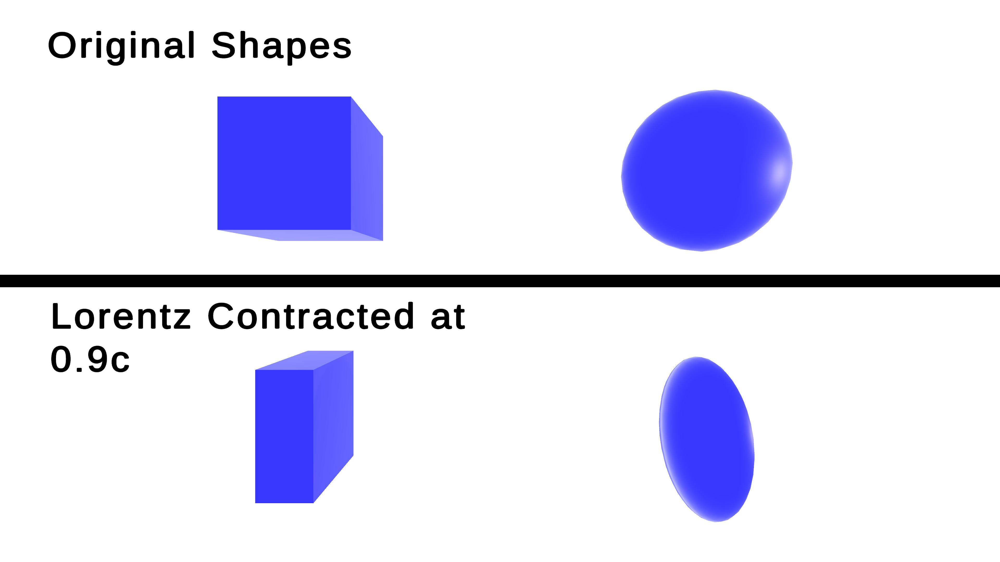

Check out the repository at: <https://github.com/Jdev31/Terrel_Penrose_Effect_Simulation>

# Introduction
This project aimed at comparing the effects length contraction to the the visual appearance of shapes at relativistic speeds. Until 1959 the visual appearance 3D objects was not considered, only the physical effects in different reference frames. Rodger Penrose and James Terrell, then independently showed objects tend to rotate instead of contract at relativistic speeds.

This project was developed using C# and the Unity Engine, making use of the MathNet Numerics library for the Linear Algebra

# Converting The Lorentz Transformation into 3D Space.

This project will be focusing on inertial frames of reference, and visualising effects in 3D. First Einsteins physical length contraction with be modeled in three dimensional space. Building off of my Lecture notes [@reynolds2025special], The lorentz transformation was given found in 1 dimensional space, assuming that all velocities were in the x direction, as shown here: 

$$
\begin{aligned}
t &= \gamma\left(t' + \frac{v x'}{c^2}\right), \\
x &= \gamma\left(x' + v t'\right), \\
y &= y', \\
z &= z',
\end{aligned}
$$ {#eq-1D-lorentz-transformation}

where

- \(t, x, y, z\) are the time and spatial coordinates of an event measured in frame \(F\),
- \(t', x', y', z'\) are the corresponding coordinates measured in frame \(F'\),
- \(v\) is the relative velocity of frame \(F'\) with respect to frame \(F\) along the \(x\)-axis,
- \(c\) is the speed of light in vacuum,
- ($\gamma$) is the Lorentz factor, defined by

$$
\gamma = \frac{1}{\sqrt{1 - \frac{v^2}{c^2}}}.
$$

This can then be converted to three dimensional space with use of the vectors $\vec{r}$ and $\vec{v}$ where $\vec{r}$ is the position vector, $\vec{v}$ is the velocity in reference frame $F$. The position vector with respect to the origin in frame $F'$ can then be written as: 
$$\vec{r}'= r_{\perp} + \gamma (r_{\parallel} + vt)\hat{r}_{\parallel}
\
$$  {#eq-basic-vector-form}

where $t$ is time in frame $F$, and $\vec{r}_{\parallel}$ and $\vec{r}_{\perp}$ represent its parallel and perpendicular components with respect to $\vec{v}$.

Noting the equations
$$
\vec{r}_{\perp} = \vec{r} - \vec{r}_{\parallel}
$$ 
$$
\vec{r}_{\parallel} = \frac{(\vec{r} \cdot \vec{v})}{v^2}\vec{v}
$$

These can be subbed into @eq-basic-vector-form to obtain
$$ 
\vec{r}' = \vec{r} + (\gamma - 1)\frac{\vec{r} \cdot \vec{v}}{v^2}\vec{v} - \gamma \vec{v}t
$$ {#eq-pre-matrix-position}

In addition to this, converting the lorentz transformation for $t'$ into vector form we obtain the equation
$$
t' = \gamma ( t - \frac{(v \cdot \vec{r}_{\parallel})}{c^2})
$$ {#eq-pre-matrix-time}

Substituting (@eq-pre-matrix-position) and (@eq-pre-matrix-time) yields the $4 \times 4$ matrix for a general Lorentz transformation. This transformation is known as a Lorentz boost @wikipediaLorentzTransformation @youtubeLorentzBoostDerivation.
$$
\begin{pmatrix}
ct' \\
x' \\
y' \\
z'
\end{pmatrix}
=
\begin{pmatrix}
\gamma
& -\dfrac{\gamma}{c} v_x
& -\dfrac{\gamma}{c} v_y
& -\dfrac{\gamma}{c} v_z
\\[6pt]
-\dfrac{\gamma}{c} v_x
& 1 + (\gamma - 1)\dfrac{v_x^2}{v^2}
& (\gamma - 1)\dfrac{v_x v_y}{v^2}
& (\gamma - 1)\dfrac{v_x v_z}{v^2}
\\[6pt]
-\dfrac{\gamma}{c} v_y
& (\gamma - 1)\dfrac{v_y v_x}{v^2}
& 1 + (\gamma - 1)\dfrac{v_y^2}{v^2}
& (\gamma - 1)\dfrac{v_y v_z}{v^2}
\\[6pt]
-\dfrac{\gamma}{c} v_z
& (\gamma - 1)\dfrac{v_z v_x}{v^2}
& (\gamma - 1)\dfrac{v_z v_y}{v^2}
& 1 + (\gamma - 1)\dfrac{v_z^2}{v^2}
\end{pmatrix}
\begin{pmatrix}
ct \\
x \\
y \\
z
\end{pmatrix}
$$ {#eq-lorenz-boost}

The Lorentz boost is then applied to all the vertices of the shape in question. However the time at each vertex depends on its distance from the origin. Let the origin be the observer in our script and let its frame of reference be $F$. While the frame of reference for the vertices if $F'$. Our known values are the constant time $t$ in frame $F$ and the positions of the vertices in frame $F'$, as the position values are related to $t$ we first need to do the inverse lorentz transformation of $t$ to get $t'$ to then correctly calculate the positions of the vertices in the observer reference frame $F$. Note, the inverse lorentz transformation can just be found by using the negative velocity, the same property as the Galilean transformation.

This matrix transform was then applied to each vertex for a cube and sphere, shown in @fig-length-contraction

{#fig-length-contraction fig-align="center" width="100%"}

# Applying the Terrel-Penrose Effect

While the lorentz contraction is a physical effect shown at relativistic speeds, when taking into account the velocity of the object traveling at fractions of the speed of light, the speed of light cannot be thought of as reaching the observer instantaneously. This means that  photons leaving an object at the same time but not at exactly the same point, wont reach the observer at the same time, causing the object to look warped. 

![Diagram of the Terrell-Penrose effect where the observer is below the length contracted sphere [@Hornofetal2025].](Figures_TP/Terrel_Penrose_Nature1.jpg){#fig-terrell-penrose}

This can be solved by creating a quadratic equation between the distance between vertices along teh same axis for simple geometric shapes @york2020terrell, however a simpler solution can be done using the equation below:
$$
\vec{r_1} = r_0 - \vec{\beta}  \|{r_0}\|  
$$ {#eq-tp-equation}

where $r_1$ is the updated position of the vertex, $r_0$ is the initial position of the vertex and $\vec{\beta} = \vec{v}/c$. This equation can be used as the velocity is constant.

----------------------------------------------------------------------

Implementation of @eq-lorenz-boost and @eq-tp-equation within the Unity engine allows for the simulation of relativistic effects from arbitrary observer perspectives. A simulation of a cube moving laterally past the observer at $0.9c$ is demonstrated in @fig-cube-side, where the predicted Terrell-Penrose rotation becomes visible; the cube appears to twist, revealing its trailing faces to a stationary observer.

::: {#fig-cube-side}


Simulation of a cube in lateral motion at $v = 0.9c$. Directional light source is placed behind the Observer.
:::

Similar to @fig-cube-side a sphere was modeled at $0.9c$ however it was raised slightly above the position of the observer, which can be compared to @fig-terrell-penrose from A snapshot of relativistic motion: visualising the Terrell-Penrose effect @Hornofetal2025. This simulation is shown in @fig-sphere-side

::: {#fig-sphere-side}


Simulation of a Sphere passing the observer at $v = 0.9c$ where it is raised slightly above the observers point of view. Directional light source is placed behind the Observer.
:::

@fig-sphere-side is slightly different to @fig-terrell-penrose, this is due to @fig-terrell-penrose Using an imaginary observer view to visualise the effect. @fig-terrell-penrose shows the apparent visual effect seen by an observer directly below the sphere, however we are observing this effect orthogonally to the actual observer and the velocity of the object. Which would show a different rotation, meaning the figure described is not what is actually seen. It does however, provide a very good method for visualising the effect, an example is shown in @fig-cube-above below.  

::: {#fig-cube-above}


Simulation of a blue cube passing directly above an observer, in green, at $v = 0.99c$. The imaginary observer is used to give a better reference of the Terrel-Penrose effect seen by the real observer.   
:::

This code provides a simulation for any shape or mesh that is imported into the the Unity Project for a constant velocity. It allows for a very easy way of understanding the Terrel-Penrose Effect. 

# Relativistic Doppler Effect
The Relativistic Doppler Effect is the same as the non relativistic doppler effect but also accounts  for the time dilation of special relativity. Unlike the classical Doppler effect for sound, which depends on motion relative to a medium, the relativistic version depends only on the relative velocity between the two parties. Although the formula as simple, I have not applied it yet as "visual light" wavelengths can very easily be shifted into other parts of the electromagnetic spectrum meaning it is not visible to the viewer. Therefore some form of mapping and key would have to introduced. In addition to this, colors stored on a computer can be represents by infinite combinations of wavelengths that would necessarily be doppler shifted exactly the same, making the shift arbitrary @metamerism. If it were to be implemented, an approach of using the dominant wavelength would be found that that would be shifted. While also taking into account shifting out of the visible light spectrum.

# References